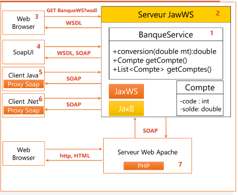
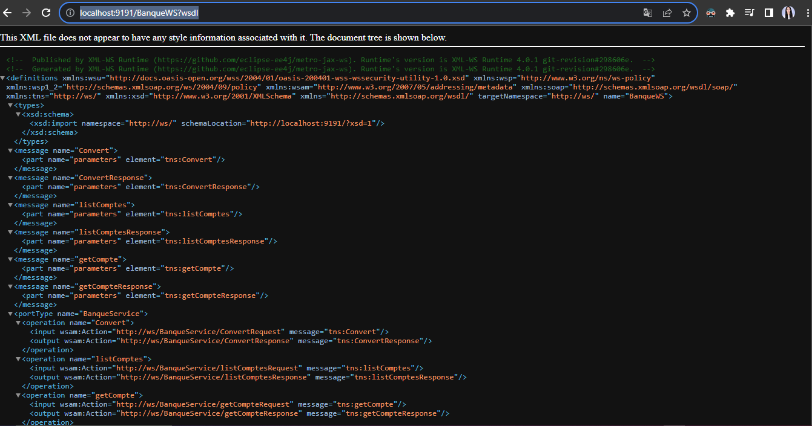
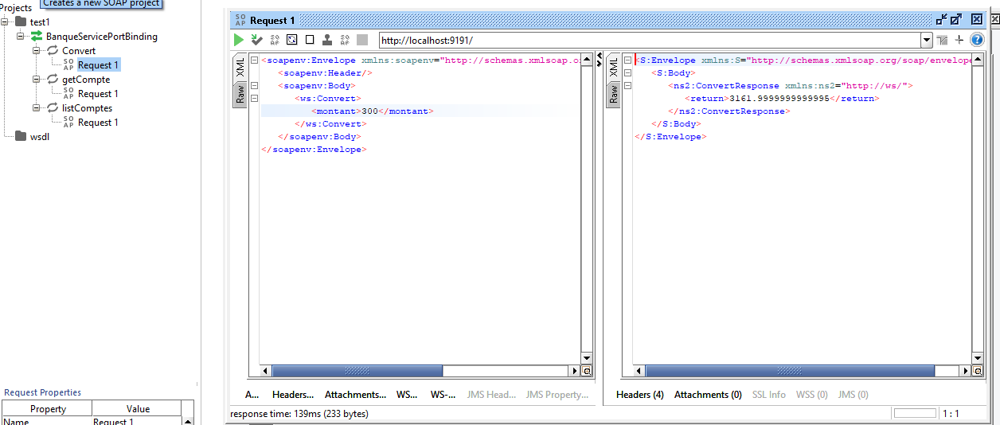
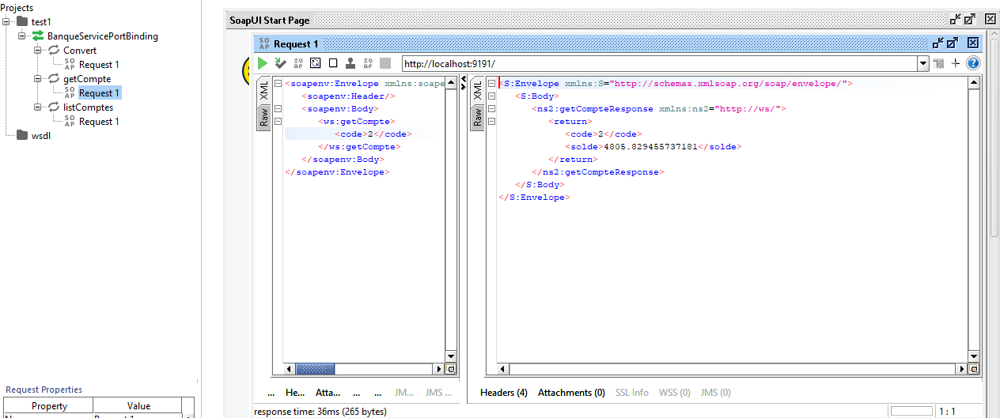
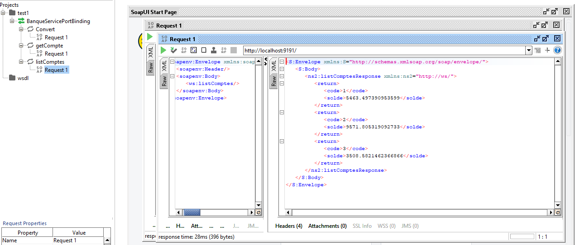

# WebServices-SOAP-WSDL-UDDI-JaxWS
Ce Tp consiste à : 

1. Créer un Web service qui permet de : 
   - Convertir un montant de l’auro en DH.
   - Consulter un Compte.
   - Consulter une Liste de comptes.
2. Déployer le Web service avec un simple Serveur JaxWS
3. Consulter et analyser le WSDL avec un Browser HTTP
4. Tester les opérations du web service avec un outil
   comme SoapUI ou Oxygen
5. Créer un Client SOAP Java
8. Déployer le Web Service dans un Projet Spring Boot

## Architecture:

## Consulter WSDL:

## Tester les methodes avec l'outil SoapUI

### La conversion :

### Consulter le compte :

### Liste des comptes :

